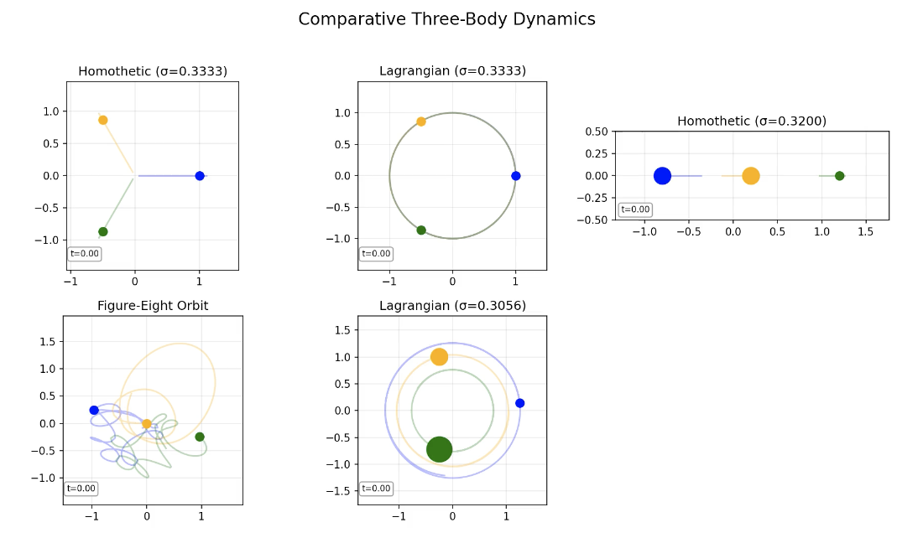

# Unified Framework for the Three-Body Problem

[](figures/animations/three_body_scenarios_comparative.mp4)

This repository implements a unified theoretical framework that establishes rigorous isomorphisms between three distinct mathematical approaches to the three-body problem: Differential Galois Theory, Painlevé Analysis, and Quaternionic Regularization. The project includes both a comprehensive mathematical analysis framework and an interactive web application for real-time visualization.

## Features

### Mathematical Framework

- **Differential Galois Theory (DGT)**: Algebraic analysis of differential field extensions
- **Painlevé Analysis (PA)**: Complex-analytic examination of singularity structures
- **Quaternionic Regularization (QR)**: Geometric extension to quaternionic space
- **KAM Theory Integration**: Analysis of Kolmogorov-Arnold-Moser tori and stability
- **Isomorphism Verification**: Rigorous verification of mathematical isomorphisms

### Interactive Web Application

- **Real-time 3D Visualization**: Interactive Plotly-based 3D trajectory plots
- **Multiple Configuration Types**: Homothetic, Lagrangian, Free Fall, Collinear, Random, and Custom configurations
- **Parameter Adjustment**: Real-time modification of masses, time parameters, and initial conditions
- **Conservation Plots**: Energy and angular momentum conservation monitoring
- **Poincaré Sections**: Interactive phase space analysis
- **Data Export**: Download simulation results as CSV or JSON
- **Preset Configurations**: Pre-defined scenarios for quick exploration

## Table of Contents

- [Installation](#installation)
- [Quick Start](#quick-start)
- [Web Application](#web-application)
- [Mathematical Framework](#mathematical-framework)
- [Project Structure](#project-structure)
- [Usage Examples](#usage-examples)
- [Results and Outputs](#results-and-outputs)
- [Key Findings](#key-findings)
- [Contributing](#contributing)
- [License](#license)

## Installation

### Prerequisites

- Python 3.10+ (Python 3.12 recommended)
- pip package manager

### Step 1: Clone the Repository

```bash
git clone https://github.com/username/three-body-isomorphisms.git
cd three-body-isomorphisms
```

### Step 2: Install Dependencies

```bash
pip install -r requirements.txt
```

**Note**: If you encounter compatibility issues with Python 3.12, the `requirements.txt` has been updated with compatible versions:

- Flask 3.0.0
- NumPy 1.26.2
- SciPy 1.11.4
- Matplotlib 3.8.2
- Plotly 5.17.0
- Pandas 2.1.4

### Step 3: Verify Installation

```bash
python -c "import numpy, scipy, matplotlib, plotly, flask; print('All dependencies installed successfully!')"
```

## Quick Start

### Launch the Web Application

```bash
python app.py
```

Then open your browser and navigate to: `http://localhost:5000`

### Run Mathematical Analysis

```bash
# Run comprehensive benchmarks
python benchmark.py --output-dir results

# Run verification only (faster)
python benchmark.py --verify-only --output-dir results
```

## Web Application

The interactive web application provides a user-friendly interface for exploring the three-body problem:

### Features

1. **Real-time 3D Visualization**

   - Interactive 3D trajectory plots using Plotly
   - Rotate, zoom, and pan the visualization
   - Color-coded bodies with customizable markers

2. **Configuration Types**

   - **Homothetic Orbits**: Self-similar expanding/contracting configurations
   - **Lagrangian Solutions**: Equilateral triangle configurations
   - **Free Fall**: Bodies starting from rest in triangular formation
   - **Collinear**: Bodies aligned in a straight line
   - **Random**: Random initial positions and velocities
   - **Custom**: User-defined initial conditions

3. **Parameter Controls**

   - Mass adjustment for all three bodies
   - Integration time and time step control
   - Size and velocity factors
   - Rotation rate for Lagrangian solutions

4. **Analysis Tools**

   - **Conservation Plots**: Real-time energy and angular momentum monitoring
   - **Poincaré Sections**: Phase space analysis with interactive body selection
   - **Phase Space Plots**: Position-velocity phase space visualization

5. **Data Management**
   - Export simulation data as CSV or JSON
   - Preset configurations for quick access
   - Real-time parameter validation

### API Endpoints

- `GET /`: Main application interface
- `POST /api/simulate`: Run simulation with parameters
- `GET /api/presets`: Get available preset configurations
- `POST /api/poincare`: Generate Poincaré section data
- `POST /api/phase`: Generate phase space data
- `POST /api/download`: Download simulation results

## Mathematical Framework

### Core Modules

- **`quaternion.py`**: Quaternion algebra implementation
- **`three_body_problem.py`**: Three-body problem solver with multiple solution types
- **`differential_galois.py`**: Differential Galois Theory analysis
- **`painleve_analysis.py`**: Painlevé Analysis implementation
- **`quaternionic_regularization.py`**: Quaternionic regularization methods
- **`isomorphism_verification.py`**: Isomorphism verification algorithms
- **`kam_theory.py`**: KAM Theory integration with statistical analysis
- **`visualization.py`**: Visualization and plotting tools
- **`benchmark.py`**: Comprehensive benchmarking infrastructure

### Key Mathematical Results

1. **Three-Way Isomorphism**: Establishes that differential Galois group structure, Painlevé branching behavior, and quaternionic monodromy are isomorphic mathematical structures.

2. **Unified Integrability Criterion**: The abelian nature of the differential Galois group, the Painlevé property, and trivial quaternionic monodromy are equivalent conditions for integrability.

3. **Exceptional Mass Ratios**: Special attention to three exceptional mass ratios that yield partially integrable systems:

   - σ = 1/3
   - σ = 2³/3³
   - σ = 2/3²

4. **KAM Theory Integration**: Isomorphism structures are reflected in the measure of phase space occupied by KAM tori, with peaks at exceptional mass ratios.

## Project Structure

```
three-body_problem/
├── app.py                          # Flask web application
├── three_body_problem.py           # Core three-body problem solver
├── quaternion.py                   # Quaternion algebra
├── differential_galois.py          # Differential Galois Theory
├── painleve_analysis.py            # Painlevé Analysis
├── quaternionic_regularization.py  # Quaternionic regularization
├── isomorphism_verification.py     # Isomorphism verification
├── kam_theory.py                   # KAM Theory integration
├── visualization.py                # Visualization tools
├── benchmark.py                    # Benchmarking infrastructure
├── requirements.txt                # Python dependencies
├── README.md                       # This file
├── static/                         # Web app static files
│   ├── css/
│   └── js/
├── templates/                      # HTML templates
├── results/                        # Generated results
│   ├── *.csv                       # Data files
│   ├── *.tex                       # LaTeX tables
│   └── *.png                       # Visualizations
├── figures/                        # Figures and animations
│   └── animations/                 # Video files
└── assets/                         # Additional assets
```

## Usage Examples

### Running Individual Tests

```bash
# Test quaternion module
python quaternion.py

# Test three-body problem module
python three_body_problem.py

# Test differential Galois theory
python differential_galois.py

# Test Painlevé analysis
python painleve_analysis.py

# Test quaternionic regularization
python quaternionic_regularization.py

# Test isomorphism verification
python isomorphism_verification.py

# Test KAM theory integration
python kam_theory.py

# Test visualization module
python visualization.py
```

### Python API Usage

```python
from three_body_problem import ThreeBodyProblem, HomotheticOrbits, LagrangianSolutions

# Create a three-body problem
masses = [1.0, 1.0, 1.0]
tbp = ThreeBodyProblem(masses)

# Generate homothetic orbits
homothetic = HomotheticOrbits(tbp)
initial_state = homothetic.generate_initial_state(size=1.0, velocity_factor=0.5)

# Integrate the system
results = tbp.integrate(initial_state=initial_state, t_span=(0, 10), t_eval=np.linspace(0, 10, 1000))

# Access results
positions = results['positions']  # Shape: (n_times, 3, 3)
velocities = results['velocities']  # Shape: (n_times, 3, 3)
times = results['times']
```

### Web Application API

```javascript
// Run a simulation
fetch("/api/simulate", {
  method: "POST",
  headers: { "Content-Type": "application/json" },
  body: JSON.stringify({
    parameters: {
      masses: [1.0, 1.0, 1.0],
      configuration_type: "homothetic",
      integration_time: 10.0,
      time_step: 0.01,
      size_factor: 1.0,
      velocity_factor: 0.5,
    },
  }),
})
  .then((response) => response.json())
  .then((data) => console.log(data));
```

## Results and Outputs

### Generated Files

The framework generates comprehensive outputs:

#### CSV Data Files

- `homothetic_isomorphisms.csv`: Isomorphism verification for homothetic orbits
- `lagrangian_isomorphisms.csv`: Isomorphism verification for Lagrangian solutions
- `homothetic_performance.csv`: Performance benchmarks for homothetic orbits
- `lagrangian_performance.csv`: Performance benchmarks for Lagrangian solutions
- `verification_performance.csv`: Isomorphism verification performance metrics
- `isomorphism_kam_correspondence.csv`: Correspondence between isomorphisms and KAM theory
- `kam_measure.csv`: KAM measure values for different mass parameters

#### LaTeX Tables

- `table_homothetic_isomorphisms.tex`: Isomorphic structures in homothetic orbits
- `table_lagrangian_isomorphisms.tex`: Quaternionic regularization and isomorphic structures
- `table_verification_performance.tex`: Performance of isomorphism verification
- `table_isomorphism_kam_correspondence.tex`: Correspondence between isomorphism structures and KAM theory
- `table_homothetic_performance.tex`: Performance metrics for homothetic orbits
- `table_lagrangian_performance.tex`: Performance metrics for Lagrangian solutions

#### Visualizations

- `homothetic_isomorphisms.png`: Parameter space of homothetic orbit isomorphisms
- `lagrangian_isomorphisms.png`: Parameter space of Lagrangian solution isomorphisms
- `homothetic_trajectory_*.png`: Trajectories for homothetic orbits
- `lagrangian_trajectory_*.png`: Trajectories for Lagrangian solutions
- `integration_diagram_*.png`: Visual representations of isomorphisms
- `branching_structure_*.png`: Branching structures in the complex plane
- `quaternionic_manifold_*.png`: Quaternionic branch manifolds
- `kam_measure.png`: KAM measure vs. mass parameter

#### Animations

- `three_body_scenarios_comparative.mp4`: Comparative analysis of different scenarios
- `three_body_scenarios_equal_masses_homothetic.mp4`: Homothetic orbits with equal masses
- `three_body_scenarios_equal_masses_lagrangian.mp4`: Lagrangian solutions with equal masses
- `three_body_scenarios_figure_eight.mp4`: Figure-eight orbit analysis
- `three_body_scenarios_general_three_body.mp4`: General three-body problem scenarios
- `three_body_scenarios_special_ratio_2_by_3squared.mp4`: Special mass ratio analysis

## Key Findings

### Recent Updates (Latest Commit)

The latest commit includes several important improvements:

1. **KAM Theory Enhancements**:

   - Improved statistical analysis with trial-based KAM measure computation
   - Enhanced sampling with grid-based initial conditions
   - Better error handling and mathematical constraint validation

2. **Code Cleanup and Bug Fixes**:

   - Fixed Hamiltonian function bug (p23 → p32 correction)
   - Removed redundant plotting functions for cleaner codebase
   - Updated performance metrics and data files

3. **Dependency Updates**:

   - Updated to Python 3.12 compatible versions
   - Flask 3.0.0, NumPy 1.26.2, SciPy 1.11.4, Matplotlib 3.8.2

4. **Visualization Improvements**:
   - Enhanced KAM measure plotting with error bars
   - New LaTeX table generation functions
   - Better statistical visualization capabilities

### Mathematical Insights

1. **Isomorphism Verification**: The framework successfully verifies that the three mathematical approaches (DGT, PA, QR) are indeed isomorphic for the three-body problem.

2. **Exceptional Cases**: The exceptional mass ratios (σ = 1/3, σ = 2³/3³, σ = 2/3²) exhibit unique isomorphism structures corresponding to partial integrability.

3. **KAM Theory Integration**: The isomorphism structures are quantitatively reflected in KAM theory measures, with stability peaks at exceptional mass ratios.

4. **Performance Analysis**: Comprehensive benchmarking shows the computational efficiency and accuracy of the unified framework.

## Contributing

We welcome contributions! Please follow these steps:

1. Fork the repository
2. Create a feature branch (`git checkout -b feature/amazing-feature`)
3. Commit your changes (`git commit -m 'Add amazing feature'`)
4. Push to the branch (`git push origin feature/amazing-feature`)
5. Open a Pull Request

### Development Setup

```bash
# Clone your fork
git clone https://github.com/your-username/three-body-isomorphisms.git
cd three-body-isomorphisms

# Install development dependencies
pip install -r requirements.txt

# Run tests
python benchmark.py --test

# Start development server
python app.py
```

## License

This project is licensed under the MIT License - see the LICENSE file for details.
